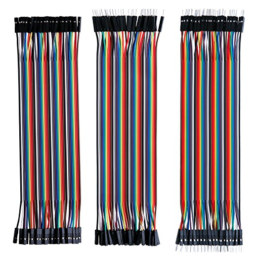
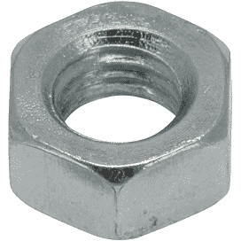

# Ice Nucleation Cold Stage

The Ice Nucleation Cold Stage (INCS) is a project using an Arduino and Raspberry Pi to control a Peltier module to cool and film droplets to the point where they freeze. 

<em>The Ice Nucleation Cold Stage on a desk.</em>

# Table of contents
1. [Overview](#overview)
1. [Buck Converter](#buck-conv)
2. [Dependencies](#Dependencies)
3. [Folder structure](#Folder-Structure)
5. [Contributing](#Contributing)
6. [Code of Conduct](#Code-of-Conduct)

## Overview 

The electronics fits in a project box, with a touchscreen, enabling ease of transport in the field.

<em>Peltier circuit inside the project box.</em>

In addition most of the other parts are 3-d printed.

## Buck Converter 
A substantial part of this project is the buck converter circult, which is controlled by an Arduino using pulse width modulation. A buck converter is required to control the Peltier module because Peltier modules require a smooth input voltage. Pulse width modulation alone is not sufficient. 

The circuit is based on a so-called low-side switch design, meaning the MosFET switch is on the "low-side" of the load [see here](images/high_side_n_channel_buck_converter.png).

The circuit for the buck converter is shown below.

<em>Buck converter circuit. It consists of an Arduino Nano; a gate driver; MosFET, Inductor, Capactor, and Schottky diode. In addition there is a 3 A buck converter and linear regulator to power the arduino from a DC input.</em>

## Dependencies 

I needed to install a library for the Arduino for PID control. The library is: PID controller by Brett Beaugard. I also had to use "Wire.h" (installed by default) .for I2C communication between the Raspberry Pi and Arduino.

For the Raspberry PI the following python libraries were used: smbus; struct; time; numpy.

## Folder structure 

The repository structure is now discussed

### Directory layout

    .                           
    ├── arduino               # code for the Arduino
    ├── images                # image files for the project
    ├── links                 # some links that I used 
    ├── matlab                # matlab files (e.g. to process video to get freezing events)
    ├── openSCAD              # Design files in openSCAD
    ├── python                # Raspberry Pi files to do temperature ramps, etc
    ├── README.md             # This readme
    └── stl						# stl design files
    
----------

**REQUIRED PARTS**

In order to **make your own Ice Nucleation Cold Stage**, you may use the **part list below** to acquire all the components **on your own**. Note, although Amazon is suggested, I often used a company supplier, which was cheaper.

<table style="width:100%">
  <tr> 
    <td>
    Raspberry Pi 3 7 inch touchscreen  
    </td>
    <td><a href="https://www.amazon.co.uk/Raspberry-Pi-7-Inch-Screen-Display/dp/B014WKCFR4/ref=sr_1_3?ie=UTF8&qid=1531558042&sr=8-3&keywords=raspberry+pi+touch+screen+7+inch" target="_blank"> Amazon </a></td> 
    <td>£63</td>
  </tr>
  
  <tr> 
    <td>
    Raspberry Pi 3 b+  
    </td>
    <td><a href="https://www.amazon.co.uk/Raspberry-Pi-Model-64-Bit-Processor/dp/B07BDR5PDW/ref=sr_1_3?ie=UTF8&qid=1531556638&sr=8-3&keywords=raspberry-pi+3+b" target="_blank"> Amazon </a></td> 
    <td>£35</td>
  </tr>
  
  <tr> 
    <td>
    Raspberry Pi Camera Board 8 Megapixel Version 2 1080p  
    </td>
    <td><a href="https://www.rapidonline.com/raspberry-pi-camera-board-8-megapixel-version-2-1080p-75-0530" target="_blank"> Rapid Online </a></td> 
    <td>£23.70</td>
  </tr>
  

  <tr>
    <td>
    Arduino Nano A000005 Board V3 
    </td>
    <td><a href="https://www.rapidonline.com/arduino-nano-a000005-board-v3-73-4448" target="_blank"> Rapid Electronics </a></td> 
    <td>£15.60</td>
  </tr>

  <tr>
    <td>
    2.54mm Pitch Vertical 8 Way, Through Hole Turned pin Open Frame IC Dip Socket, 5A 
    </td>
    <td><a href="https://uk.rs-online.com/web/p/dil-sockets/0813115/" target="_blank"> RS Components </a></td> 
    <td>£0.38</td>
  </tr>

  <tr>
    <td>
    Rapid Stripboard 95 x 127mm (x2) 
    </td>
    <td><a href="https://www.rapidonline.com/rapid-stripboard-95-x-127mm-34-0515" target="_blank"> Rapid Online </a></td> 
    <td>£3.84</td>
  </tr>

  <tr>
    <td>
    2200 uF capactor, 35V. 
    </td>
    <td><a href="https://uk.farnell.com/panasonic-electronic-components/eca1vhg222/cap-alu-elec-2200uf-35v-rad/dp/1848552?st=CAPACITOR,%202200UF%2035V;%20Automotive%20Qualification%20Standard:AEC-Q200" target="_blank"> Farnell </a></td> 
    <td>£1.27</td>
  </tr>

  <tr>
    <td>
    470 µH, 7A, 0.064 ohm, ± 20%, Inductor 
    </td>
    <td><a href="https://uk.farnell.com/abracon/atca-08-471m-v/inductor-470uh-7a-20-radial/dp/2665051?krypto=pY3JNPCYatNk0vDDUf4Tn9JLFiz93rvd2B4Xt3Ip1h5SCi3yEomoX%2BUEleAGflP2kAMSJSf9N%2FZLG3PFYvM%2Bmw%3D%3D&ddkey=https%3Aen-GB%2FElement14_United_Kingdom%2Fsearch" target="_blank"> Farnell </a></td> 
    <td>£9.89</td>
  </tr>

  <tr>
    <td>
    IRF520NPBF -  MOSFET Transistor, N Channel  
    </td>
    <td><a href="https://uk.farnell.com/infineon/irf520npbf/mosfet-n-100v-9-7a-to-220ab/dp/9103031" target="_blank"> Farnell </a></td> 
    <td>£0.65</td>
  </tr>

  <tr>
    <td>
    VS-15TQ060PBF -  Schottky Rectifier  
    </td>
    <td><a href="https://uk.farnell.com/vishay-semiconductor/vs-15tq060pbf/diode-schottky-15a-60v-to-220ac/dp/8657009" target="_blank"> Farnell </a></td> 
    <td>£2.05</td>
  </tr>

  <tr>
    <td>
    Cooler Master Hyper TX (RR-PCH-s9U1-GP)  
    </td>
    <td><a href="https://www.amazon.co.uk/Cooler-Master-Socket-775-650-1800RPM-41-76-CFM/dp/B000K0ZSH0" target="_blank"> This was given to me. It is discontinued, but any similar heat sink could be used (e.g. the Cooler Master Hyper TX3i) </a></td> 
    <td>approx. £30</td>
  </tr>

  <tr>
    <td>
    mc34152 Gate Driver  
    </td>
    <td><a href="https://uk.rs-online.com/web/p/mosfet-power-drivers/5165506/" target="_blank"> RS Components </a></td> 
    <td>£1.15</td>
  </tr>

  <tr>
    <td>
    Enclosure  
    </td>
    <td><a href="https://www.ebay.co.uk/itm/1591XXFSBK-Genuine-Hammond-Black-ABS-Enclosure-Box-221-x-150-x-63mm/262220045766?hash=item3d0d885dc6:g:-PkAAOSw1BlZVgdG" target="_blank"> Ebay </a></td> 
    <td>£10</td>
  </tr>

  <tr>
    <td>
    Micro SD card 
    </td>
    <td><a href="https://www.amazon.co.uk/gp/offer-listing/B073JWXGNT/ref=sr_1_5_olp?s=electronics-accessories&ie=UTF8&qid=1531613685&sr=1-5&keywords=micro+sd+card" target="_blank"> Amazon </a></td> 
    <td>£8</td>
  </tr>

  <tr>
    <td>
    2 Pin 5 mm Pinch PCB Mount Screw Terminal Block Connector 
    </td>
    <td><a href="https://www.amazon.co.uk/gp/product/B01MT4LC0F/ref=oh_aui_detailpage_o03_s00?ie=UTF8&psc=1" target="_blank"> Amazon </a></td> 
    <td>£6</td>
  </tr>

  <tr>
    <td>
    Buck converter  
    </td>
    <td><a href="https://www.amazon.co.uk/gp/product/B00K67XSYC/ref=oh_aui_detailpage_o06_s00?ie=UTF8&psc=1" target="_blank"> Amazon </a></td> 
    <td>£8</td>
  </tr>

  <tr>
    <td>
    Linear regulator 10V, 1A 
    </td>
    <td><a href="https://uk.farnell.com/on-semiconductor/ka7810etu/linear-volt-reg-1a-10v-to-220ab/dp/2451046" target="_blank"> Farnell </a></td> 
    <td>£3</td>
  </tr>
  
  <tr>
    <td>
    Slide switch  
    </td>
    <td><a href="https://www.amazon.co.uk/gp/product/B008R50AA0/ref=oh_aui_detailpage_o07_s00?ie=UTF8&psc=1" target="_blank"> Amazon </a></td> 
    <td>£0.15</td>
  </tr>
  
  <tr>
    <td>
    PCB Header Connectors  
    </td>
    <td><a href="https://www.amazon.co.uk/gp/product/B01M69EA9O/ref=oh_aui_detailpage_o03_s00?ie=UTF8&psc=1" target="_blank"> Amazon </a></td> 
    <td>£5</td>
  </tr>
  
  <tr>
    <td>
    Dupoint wires  
    </td>
    <td><a href="https://www.amazon.co.uk/gp/product/B01EV70C78/ref=oh_aui_detailpage_o04_s00?ie=UTF8&psc=1" target="_blank"> Amazon </a></td> 
    <td>£6</td>
  </tr>
  
  <tr>
    <td>
    20AWG Wire  
    </td>
    <td><a href="https://uk.rs-online.com/web/p/hookup-equipment-wire/0331935/?relevancy-data=636F3D3126696E3D4931384E525353746F636B4E756D626572266C753D656E266D6D3D6D61746368616C6C26706D3D5E282872737C5253295B205D3F293F2832355C647B387D7C32355C647B317D5C2D5C647B377D7C5C647B337D5B5C2D5D3F5C647B332C347D5B70505D3F292426706F3D3126736E3D592673723D2673743D52535F53544F434B5F4E554D4245522677633D4E4F4E45267573743D333331393335267374613D3033333139333526" target="_blank"> RS Online </a></td> 
    <td>£13.03</td>
  </tr>
  
  <tr>
    <td>
    Affix Pozi Pan Head Stainless Steel Screws M2.5 12mm   
    </td>
    <td><a href="https://www.rapidonline.com/Affix-Pozi-Pan-Head-Stainless-Steel-Screws-M2-5-12mm-Pack-Of-100-33-4205?utm_source=AffWin&utm_medium=Affiliate&awc=1799_1531559350_6bf53c34df454762e1e501399281f666" target="_blank"> Rapid online </a></td> 
    <td>£3.40</td>
  </tr>
  
  <tr>
    <td>
    Affix Stainless Steel Plain Washers M2.5   
    </td>
    <td><a href="https://www.rapidonline.com/affix-stainless-steel-plain-washers-m2-5-pack-of-100-33-4315" target="_blank"> Rapid online </a></td> 
    <td>£1</td>
  </tr>
  
  <tr>
    <td>
    M2.5 nuts  
    </td>
    <td><a href="https://www.rapidonline.com/tr-fastenings-w-m2-5-hfst-tc1-steel-full-nuts-metric-m2-5-box-of-100-33-6589" target="_blank"> Rapid online </a></td> 
    <td>£1.20</td>
  </tr>
  
  <tr>
    <td>
    Potentiometer  
    </td>
    <td><a href="https://www.amazon.co.uk/gp/product/B01G6P1H68/ref=oh_aui_detailpage_o07_s00?ie=UTF8&psc=1" target="_blank"> Amazon </a></td> 
    <td>£1.27 for 5</td>
  </tr>
  
  <tr>
    <td>
    Terminal Blocks  
    </td>
    <td><a href="https://www.amazon.co.uk/gp/product/B00O9W183I/ref=oh_aui_detailpage_o01_s00?ie=UTF8&psc=1" target="_blank"> Amazon </a></td> 
    <td>£6.32 for 10</td>
  </tr>
  
  <tr>
    <td>
    Fuses for DC Power supply  
    </td>
    <td><a href="https://www.amazon.co.uk/gp/product/B01CEB6B1Y/ref=oh_aui_detailpage_o04_s00?ie=UTF8&psc=1" target="_blank"> Amazon </a></td> 
    <td>£5.29 for many!</td>
  </tr>
  
  <tr>
    <td>
    Raspberry Pi camera cable, 50cm  
    </td>
    <td><a href="https://www.ebay.co.uk/itm/Raspberry-Pi-Camera-Cable-50-cm/152700214804?ssPageName=STRK%3AMEBIDX%3AIT&_trksid=p2057872.m2749.l2649" target="_blank"> Ebay </a></td> 
    <td>£1.20</td>
  </tr>
  
  <tr>
    <td>
    AD8495 thermocouple  
    </td>
    <td><a href="https://www.amazon.co.uk/gp/product/B0744M3DQD/ref=oh_aui_search_detailpage?ie=UTF8&psc=1" target="_blank"> Amazon </a></td> 
    <td>£4.99</td>
  </tr>
  
  <tr>
    <td>
    Heat sinks for mosFET and 5V linear regulator.  
    </td>
    <td><a href="https://www.amazon.co.uk/gp/product/B01IN11NWG/ref=oh_aui_detailpage_o02_s00?ie=UTF8&psc=1" target="_blank"> Amazon </a></td> 
    <td>£2.00</td>
  </tr>
  
  <tr>
    <td>
    24V, 15A Universal Regulated Switching Power Supply.  
    </td>
    <td><a href="https://www.ebay.co.uk/itm/DC-5-12-24V-Universal-Regulated-Switching-Power-Supply-for-LED-Strip-CCTV-UK-/172578089978?oid=183217277720" target="_blank"> Ebay </a></td> 
    <td>£13.59</td>
  </tr>
  
  <tr>
    <td>
    3 Pin IEC320 C14 Inlet Module.  
    </td>
    <td><a href="https://www.ebay.co.uk/itm/3-Pin-IEC320-C14-Inlet-Module-Plug-Fuse-Switch-Male-Power-Socket-10A-250V-L5V1-/282655120864" target="_blank"> Ebay </a></td> 
    <td>£1.01</td>
  </tr>
  
  <tr>
    <td>
    3.5mm Pitch 2Pin PCB Mount Screw Terminal Block Connector.  
    </td>
    <td><a href="https://www.amazon.co.uk/gp/product/B00XL5BMP8/ref=oh_aui_search_detailpage?ie=UTF8&psc=1" target="_blank"> Amazon </a></td> 
    <td>£2.94</td>
  </tr>
  
  <tr>
    <td>
    10 Metres 4mm Brown Sleeving On A Roll.  
    </td>
    <td><a href="https://www.amazon.co.uk/gp/product/B006I1K7NU/ref=oh_aui_search_detailpage?ie=UTF8&psc=1" target="_blank"> Amazon </a></td> 
    <td>£2.99</td>
  </tr>

  <tr>
    <td>
    40 mm fan guard  
    </td>
    <td><a href="https://www.rapidonline.com/SUNON-FG-04-Fan-Grill-40mm-x-40mm-50-5138?IncVat=1&pdg=aud-313476735010:pla-336800058227:kwd-336800058227:cmp-757438067:adg-44804851896:crv-207912323492:pid-50-5138:dev-c&gclid=Cj0KCQjwv-DaBRCcARIsAI9sba88Hs9De4c6fpl-Nrf_ln1wQZMeWvz_mbl0ramittN_1RAl-sdb2TAaAj1EEALw_wcB" target="_blank"> Rapid electronics </a></td> 
    <td>£3.50</td>
  </tr>

  <tr>
    <td>
    40 mm fan  
    </td>
    <td><a href="https://www.reichelt.com/gb/en/fan-5-v-dc-0-9-w-rpm-5800-fan-4010-5v-p43677.html?CTYPE=0&MWSTFREE=0&PROVID=2788&wt_guka=54951061155_263550072470&PROVID=2788&gclid=Cj0KCQjwv-DaBRCcARIsAI9sba-WNEJHtybDi85atG_sroZEsvyVNrddHD7doeqlnKYRUztaJ6kxCHgaAnc5EALw_wcB&" target="_blank"> Reichelt electronics </a></td> 
    <td>£2.50</td>
  </tr>
  
  <tr>
    <td>
    550 x 250 x 8 mm perspex sheet (clear)  
    </td>
    <td><a href="http://www.plasticsheets.com/?gclid=Cj0KCQjwx43ZBRCeARIsANzpzb9o_f5blJqmZOe1sliMkC1TyBPAPn1GouSZxKyQbyZHcnOesRTrROwaArQVEALw_wcB" target="_blank"> Plastic sheets </a></td> 
    <td>£12.38</td>
  </tr>
  
  <tr>
    <td>
    LED  
    </td>
    <td><a href="https://www.amazon.co.uk/dp/B00CM5DEZO/ref=sxts_kp_lp_3?pf_rd_m=A3P5ROKL5A1OLE&pf_rd_p=fb7bbe16-4a21-4f5a-938c-e2ac1558fbcd&pd_rd_wg=WvUCM&pf_rd_r=G8N068HW8BDFM7DW6CEY&pf_rd_s=desktop-sx-top-slot&pf_rd_t=301&pd_rd_i=B00CM5DEZO&pd_rd_w=RxAWr&pf_rd_i=leds&pd_rd_r=ad3598ab-370e-4f6e-a6e7-f164199962c9&ie=UTF8&qid=1535959984&sr=3" target="_blank"> Amazon </a></td> 
    <td>£0.65</td>
  </tr>
  
  <tr>
    <td>
    IEC Cable  
    </td>
    <td><a href="https://uk.rs-online.com/web/p/power-cable-assemblies/2621154/" target="_blank"> RS Components </a></td> 
    <td>£6.50</td>
  </tr>
  
  <tr>
    <td>
    Peltier Element, 16V, 7.8A  
    </td>
    <td><a href="https://uk.farnell.com/european-thermodynamics/ap2-162-1420-1118/peltier-cooler-module-16vdc-29/dp/2519563" target="_blank"> Farnell </a></td> 
    <td>£99.89</td>
  </tr>
  
  <tr>
    <td>
    25x25mm microscope slides  
    </td>
    <td><a href="https://www.fishersci.co.uk/shop/products/microscope-slides-cut-square-13/15522802?searchHijack=true&searchTerm=15522802&searchType=RAPID&matchedCatNo=15522802" target="_blank"> Fisher </a></td> 
    <td>£30.76 exc VAT for 1000</td>
  </tr>
  
  
  <tr>
    <td>
    0.1 uF capacitor  
    </td>
    <td><a href="https://uk.rs-online.com/web/p/ceramic-multilayer-capacitors/8523299/?relevancy-data=636F3D3126696E3D4931384E525353746F636B4E756D626572266C753D656E266D6D3D6D61746368616C6C26706D3D5E282872737C5253295B205D3F293F2832355C647B387D7C32355C647B317D5C2D5C647B377D7C5C647B337D5B5C2D5D3F5C647B332C347D5B70505D3F292426706F3D3126736E3D592673723D2673743D52535F53544F434B5F4E554D4245522677633D4E4F4E45267573743D38353233323939267374613D3835323332393926" target="_blank"> RS Components </a></td> 
    <td>£1.00</td>
  </tr>
  
  <tr>
    <td>
    1 uF tantalum capacitor  
    </td>
    <td><a href="https://www.rapidonline.com/Catalogue/Product/11-1036" target="_blank"> Rapid Online </a></td> 
    <td>£0.27</td>
  </tr>
  
  <tr>
    <td>
    Affix Black Pozi Pan Head Machine Screws M3 12mm - Pack Of 100  
    </td>
    <td><a href="https://www.rapidonline.com/Catalogue/Product/33-2630" target="_blank"> Rapid Online </a></td> 
    <td>£1.55</td>
  </tr>
  
  <tr>
    <td>
    Affix Slotted Countersunk Machine Screws BZP M4 16mm - Pack Of 100  
    </td>
    <td><a href="https://www.rapidonline.com/Catalogue/Product/33-2885" target="_blank"> Rapid Online </a></td> 
    <td>£1.58</td>
  </tr>
  
  <tr>
    <td>
    Affix Pozi Countersunk Machine Screws BZP M4 12mm - Pack Of 100  
    </td>
    <td><a href="https://www.rapidonline.com/Catalogue/Product/33-2970" target="_blank"> Rapid Online </a></td> 
    <td>£2.47</td>
  </tr>
  
  <tr>
    <td>
    Toolcraft 193152 Slotted Countersunk Screws DIN 963 4.8 Steel M4x20mm Pk 100  
    </td>
    <td><a href="https://www.rapidonline.com/Catalogue/Product/51-3237" target="_blank"> Rapid Online </a></td> 
    <td>£4.78</td>
  </tr>
  
  
  <tr>
    <td>
    Affix Stainless Steel Nuts M4 - Pack Of 100  
    </td>
    <td><a href="https://www.rapidonline.com/Catalogue/Product/33-4310" target="_blank"> Rapid Online </a></td> 
    <td>£3.00</td>
  </tr>
  
  
  <tr>
    <td>
    LIGHTWEIGHT ZINC EFFECT METAL BUTT HINGE, PACK OF 2  
    </td>
    <td><a href="https://www.diy.com/departments/lightweight-zinc-effect-metal-butt-hinge-pack-of-2/254482_BQ.prd" target="_blank"> B&Q </a></td> 
    <td>£1.47</td>
  </tr>
  
  
  	
  <tr>
    <td>
    Linear regulator  
    </td>
    <td><a href="https://www.amazon.co.uk/LM338T-Adjustable-Positive-Voltage-Regulator/dp/B07F2YMXTR/ref=sr_1_cc_1?s=aps&ie=UTF8&qid=1531560057&sr=1-1-catcorr&keywords=lm338" target="_blank"> Amazon </a></td> 
    <td>£3</td>
  </tr>
  
	
		
	
		
</table>

Plus: 
<ul>
<li> Resistors: 680 &Omega; ;2x220 &Omega; ;50 k &Omega;
<li> USB keyboard and mouse; 
<li> M4 washers (already had some)
<li> M4 rod for screwing down cover (already had some)
<li> some other wire 22awg for low current connections;  
<li> some thermocouple wire (K-type).
<li> Spade connectors.
<li> 240V cable (usually butcher a spare IEC cable with a US plug).
<li> 3-d printing materials:
	<ul>
	<li> ABS plastic
	<li> PLA plastic
	<li> TPU plastic
	</ul>
</ul>

## Contributing

Contributions to INCS are more than welcome. I am sure there are many improvements that could be made. I am very happy to discuss ideas for improvement and how to add/remove features.  

Please use the issue tracker at https://github.com/UoM-maul1609/ice-nucleation-cold-stage/issues if you want to notify me of an issue or need support. If you want to contribute, please either create an issue or make a pull request. Alternatively, come and see me in Manchester and/or lets meet for a coffee and a chat!

## Code of Conduct

To be arranged.